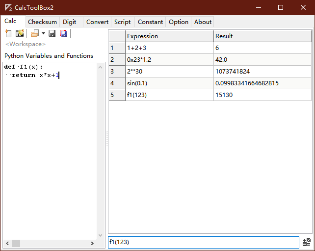
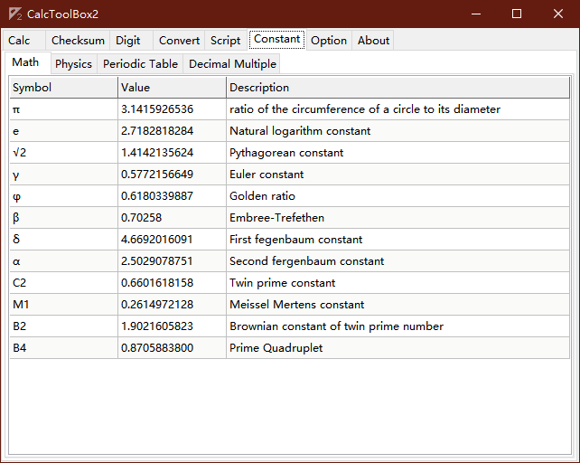

# CalcToolbox2

**Calc Toolbox 2** is a small cross-platform calculation software for engineer calculation. And redesign the architecture, use the new kernel, make it more practical.

Calc Toolbox 2 is develop with Lazarus 2.0.12 and FPC 3.2.0, and use some third party components, functions and software:

## Components

- CRC algorithm from  
  https://www.iteye.com/blog/kiolp-2262455

- Base convert function from  
  https://blog.csdn.net/tianqin20140902/article/details/44151717

- Big Float function from  
  http://www.delphiforfun.org.ws034.alentus.com/Programs/Library/bigfloat.htm

- PascalScript (Integrate with Lazarus IDE)  
  https://wiki.lazarus.freepascal.org/index.php/Pascal_Script

- SynEdit (Integrate with Lazarus IDE)  
  https://wiki.freepascal.org/SynEdit

- RichMemo  
  https://wiki.freepascal.org/RichMemo

## Software

- micropython  
  https://www.micropython.org

## Screenshot

- calculator

- constant

## Link

- [Change log](changelog.md)
